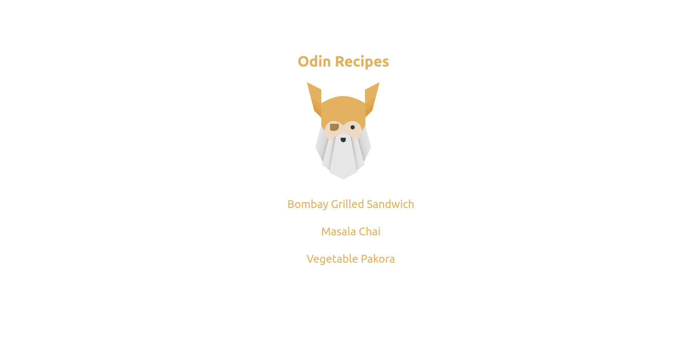
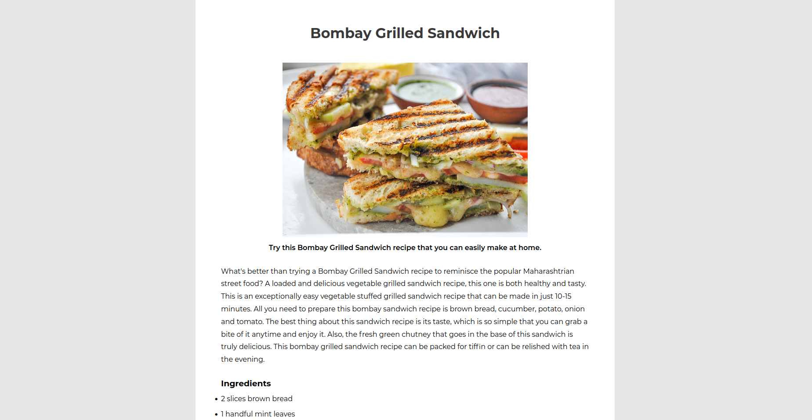
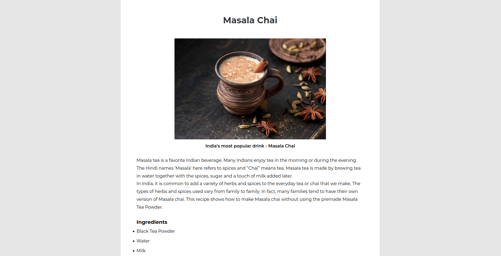
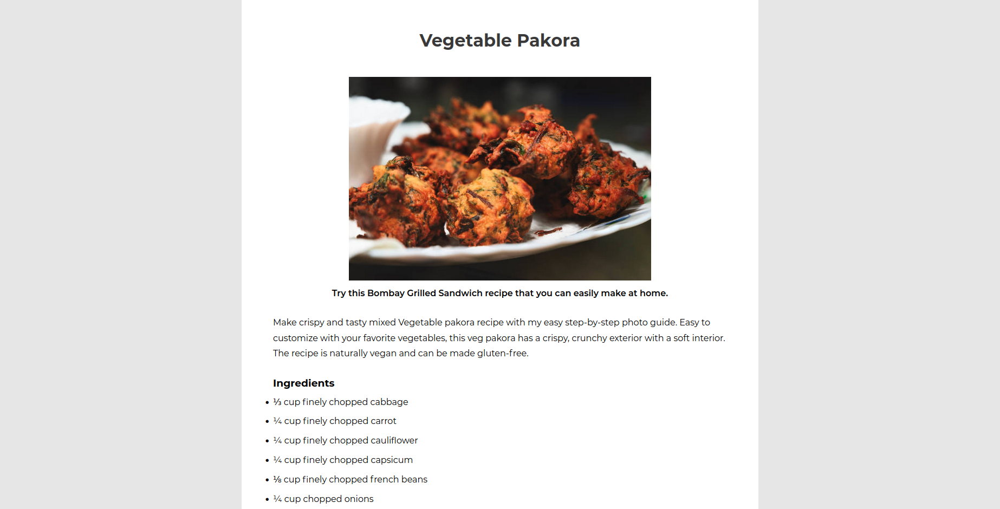

# Odin Recipes 

This is an introductory project for HTML and CSS by [The Odin Project](https://www.theodinproject.com/).

Assignment: Build a basic recipe website using to put your HTML and CSS knowlege into practice.
### Tech Stack

HTML5, CSS3

### Lessons Learned

1. Learnt to use HTML heading and p tags and got familar with HTML structuring.
2. Learnt basic CSS styling - color, font-styling, positioning elements.
### Screenshots

#### Fun Fact
The recipes included are some of my favorite snacks :P